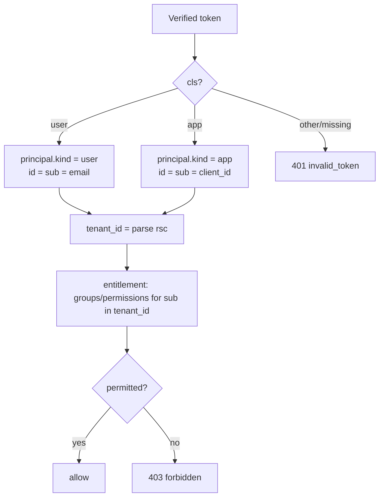

# API Auth Middleware Contract — user- and app-based JWT, opt-in audience check

> **Audience:** engineers building the auth middleware for any resource API that
> consumes identity-server access tokens (`ai-gateway`, `state`, `file`,
> `config`, MCP servers, …).
>
> This is the **identity/authorization** contract: how to validate a token, how
> to tell a **human** apart from an **app**, what to put on your request
> context, and how to **opt in** to per-resource audience enforcement.
>
> It is the companion to the rotation-specific
> [`JWT-Auth-Middleware-Key-Rotation-Contract.md`](./JWT-Auth-Middleware-Key-Rotation-Contract.md)
> (how to survive a signing-key rotation). **Both apply.** If they ever seem to
> conflict, the rotation contract wins on key handling and this one wins on
> claims handling.

---

## 1. What every token guarantees

The identity server signs **RS256** access tokens with a `kid` header. After you
verify the signature (per the rotation contract), you can rely on this claim
set:

| Claim | Type | Meaning |
| ----- | ---- | ------- |
| `iss` | string | `https://auth.grasp-daas.com` (per env) — **must** match your env issuer |
| `sub` | string | **identity**: user **email** if `cls=user`, app **client_id** if `cls=app` |
| `cls` | string | `"user"` or `"app"` — principal *kind* (see §3) |
| `rsc` | string | `"<tenant_id>:<tenant_name>"` — **tenant binding** (parse the UUID before the first `:`) |
| `aud` | string or string[] | intended audience(s) — see §4 |
| `rol` | string[] | coarse flags: subset of `root`/`staff`/`superuser` (**not** permissions) |
| `exp`/`nbf`/`iat` | int | standard time bounds |
| `jti` | string | unique token id |
| `ver` | string | claim-schema version (`2.0.0`) |

> **The IdP asserts identity, not permission.** It tells you *who* (`sub`),
> *which tenant* (`rsc`), and *what kind* (`cls`). Your service resolves
> **permissions** by asking the **entitlement server** "what can `sub` in tenant
> `<tenant_id>` do?" — never by trusting a permission list in the token (there
> isn't one beyond `rol`).

---

## 2. The contract (MUST / SHOULD)

A conforming middleware:

- **MUST** verify the RS256 signature by resolving the key via the token's `kid`
  from the live JWKS (see the rotation contract). **MUST NOT** pin a key or
  accept `alg: none`/HS\*.
- **MUST** enforce `iss` == your environment's issuer.
- **MUST** enforce `exp`/`nbf` with ≤ 60 s clock-skew leeway.
- **MUST** parse `cls` and expose a normalized principal (§3). A token with an
  unrecognized `cls` is invalid → `401`.
- **MUST** parse the **tenant id** from `rsc` (substring before the first `:`)
  and scope every downstream authorization/data access to it. Cross-tenant
  access **MUST** be impossible from a token alone.
- **MUST** enforce **audience** when audience checking is enabled for the route
  (§4). When enabled, `aud` **MUST** contain your service's exact resource id.
- **MUST** return `401` (with `WWW-Authenticate`) for signature/`iss`/`exp`/
  unknown-`kid`/bad-`cls` failures, and `403` for *authenticated-but-not-allowed*
  (entitlement) failures. Never `5xx` for a bad token.
- **SHOULD** treat `sub` as the stable identity key for entitlement lookups and
  logging; **SHOULD** log `jti`, `cls`, tenant, and route for audit.
- **SHOULD NOT** use `rol` for fine-grained authorization — it is coarse and
  advisory; defer to the entitlement server.

---

## 3. Honouring user-based **and** app-based tokens (`cls`)

The single most important behavior: **both** principal kinds are first-class.
Your middleware must accept both and normalize them.



| `cls`  | `sub` is… | typical caller | how to treat it |
| ------ | --------- | -------------- | --------------- |
| `user` | email | a human (interactive login, auth-code, refresh) | act as that human within their tenant |
| `app`  | client_id | a machine app acting **for its owner** | act as that app's owner within the owner's tenant |

Both are tenant-bound identically (`rsc`). The entitlement decision is the same
shape — "which groups does `sub` belong to in this tenant?" — so most code paths
don't branch on `cls`; you branch only when a route is *human-only* or
*machine-only*.

> **Do not** assume `sub` is an email. For `cls=app` it is a `client_id`. Key
> entitlement and logging on `(cls, sub, tenant_id)`.

---

## 4. Opt-in audience check

Audience (`aud`) is the **audience-confusion guard**: it ensures a token minted
for service X cannot be replayed against service Y just because the signature is
valid. The identity server sets `aud` from the client's RFC 8707 `resource`
request (allowlist-gated) or the shared default audience.

`aud` is always evaluated as a **set membership** test — treat it as a list even
when it is a single string. A token is acceptable to your service if **any**
value you accept is present in `aud`.

### 4.0 The audience model (read this first)

A token's `aud` takes one of two shapes, and your service must accept both for
the platform to behave consistently:

| `aud` value | How it arises | What it means |
| --- | --- | --- |
| `["https://grasp-daas.com"]` (shared host) | client sent **no** `resource` | a **mesh-wide** token — usable across all first-party APIs |
| `"https://grasp-daas.com/api/<svc>/<ver>"` (one resource id) | client sent a single `resource=` | a **narrowed** token — usable only at that API |

**The rule every resource server MUST implement:** accept a token whose `aud`
contains **either** the shared platform host `https://grasp-daas.com` **or** your
own `AUTH_RESOURCE_ID`. That single rule gives you:

- default tokens work mesh-wide (the "normal scenario"), and
- a client can narrow to least-privilege by requesting a specific resource — a
  narrowed token omits the shared host, so other services reject it cleanly.

Because not every service has a registered resource id yet, audience enforcement
is **opt-in per service / per route**:

| Mode | When to use | Behavior |
| ---- | ----------- | -------- |
| **enforced** (recommended for resource servers) | your service has a stable resource id | reject (`401`) unless `aud` contains the **shared host** or your **exact resource id** |
| **off** (default-safe fallback) | early integration, or routes that legitimately accept default-audience tokens | skip the `aud` value check (signature/iss/exp still enforced) |

### 4.1 Configuration shape

```
AUTH_AUDIENCE_REQUIRED = true|false      # master switch (default false)
AUTH_RESOURCE_ID       = "https://grasp-daas.com/api/state/v1"   # this service's id
AUTH_SHARED_AUDIENCE   = "https://grasp-daas.com"               # mesh-wide audience
```

- When `AUTH_AUDIENCE_REQUIRED=true`: either `AUTH_SHARED_AUDIENCE` **or**
  `AUTH_RESOURCE_ID` **must** be present in the token's `aud` (string or array),
  otherwise the request is `401 invalid_token` (`error_description="audience"`).
  Accepting the shared audience is what lets a default (mesh-wide) token reach
  your service; accepting your own id is what lets a narrowed token reach it.
- When `false`: do not validate the `aud` *value*, but still parse it for
  logging. **Flip to `true` once your clients request your resource id** — that
  is the secure end state.
- Per-route override: a route may force enforcement even if the global switch is
  off (e.g. a sensitive admin route).

> Coordinate with the IdP: your `AUTH_RESOURCE_ID` must be on
> `OAUTH_RESOURCE_ALLOWLIST` for the IdP to honor it in `resource=` requests
> (otherwise tokens fall back to the default audience and enforcement would
> reject them).

### 4.2 Token pass-through across a service mesh

Some services **forward the caller's bearer token unchanged** to downstream
services instead of minting a new one. For example:

```
Client ──Bearer T──▶ AI Gateway ──Bearer T──▶ Tools API ──Bearer T──▶ state / file / config / ...
                     (aud check)              (aud check)             (aud check each)
```

The **same token `T`** is validated at every hop, so `T` must be acceptable to
all of them at once. Under the membership rule (§4.0) that means `T.aud` must
contain the **shared host** `https://grasp-daas.com`.

- A **default token** (client sent no `resource`) has `aud =
  ["https://grasp-daas.com"]` → every hop accepts it. ✅ **This is the shape to
  use for any token you intend to forward.**
- A **narrowed token** (client sent `resource=…/ai-gateway/v1`) has `aud =
  "…/ai-gateway/v1"` → the AI Gateway accepts it, but the Tools API rejects it
  (neither the shared host nor `…/tools/v1` is present). ❌ Forwarding breaks at
  the second hop — by design.

**Wiring rules for a forwarding service (e.g. AI Gateway, Tools API):**

1. Authenticate the inbound token with the standard middleware
   (`AUTH_AUDIENCE_REQUIRED=true`, accept **shared host OR own `AUTH_RESOURCE_ID`**).
2. Forward the **verified** token verbatim on the downstream call
   (`Authorization: Bearer <same token>`). Do **not** strip or rewrite it.
3. Propagate the request-context identity (`sub`, `cls`, `tenant_id`, `jti`) and
   correlation/`REQUEST_ID` headers for audit continuity across hops.
4. Never downgrade trust between hops: each downstream re-verifies signature,
   `iss`, `exp`, and audience independently — forwarding is not a bypass.

```python
# Inside an authenticated AI Gateway / Tools API route, calling downstream.
# `request.principal` was set by `authenticate()` (§5); `raw_token` is the
# verified bearer string from the inbound Authorization header.
async def call_downstream(raw_token: str, request_id: str, payload: dict):
    headers = {
        "Authorization": f"Bearer {raw_token}",   # forward verbatim
        "X-Request-Id": request_id,                # audit continuity
    }
    # The downstream (e.g. Tools API) runs the SAME middleware and re-validates.
    return await http.post(f"{TOOLS_API_BASE}/invoke", json=payload, headers=headers)
```

> **Trade-off (state it in your threat model):** a shared-host token is a
> *mesh-wide* credential — every first-party API accepts it. That is what makes
> pass-through work, but it also means audience does not constrain *which* hop a
> forwarded token reaches. If you need hop-level least privilege (a Tools token
> that cannot be replayed at the Gateway), use **token exchange (RFC 8693)** at
> each hop instead of forwarding — heavier, and usually unnecessary inside a
> trusted first-party mesh.
>
> **Do not request a `resource` for tokens you intend to forward** — narrowing
> and pass-through are mutually exclusive.

---

## 5. Reference implementations

### 5.1 Python (FastAPI / Starlette-style), `PyJWT` + `PyJWKClient`

```python
import jwt
from jwt import PyJWKClient, PyJWKClientError

ISSUER = "https://auth.grasp-daas.com"                      # per env
JWKS_URI = f"{ISSUER}/oauth/.well-known/jwks.json"
RESOURCE_ID = "https://grasp-daas.com/api/state/v1"          # this service
SHARED_AUDIENCE = "https://grasp-daas.com"                  # mesh-wide audience
AUDIENCE_REQUIRED = True                                     # opt-in switch

_jwks = PyJWKClient(JWKS_URI, cache_keys=True, lifespan=300)  # resolves by kid


class Principal:
    def __init__(self, claims: dict):
        cls = claims.get("cls")
        if cls not in ("user", "app"):
            raise Unauthorized("invalid_token", "bad cls")
        self.kind = cls                       # "user" | "app"
        self.id = claims["sub"]               # email (user) | client_id (app)
        self.tenant_id = claims["rsc"].split(":", 1)[0]   # uuid before ':'
        self.roles = claims.get("rol", [])
        self.jti = claims.get("jti")
        self.claims = claims


def authenticate(token: str) -> Principal:
    try:
        signing_key = _jwks.get_signing_key_from_jwt(token)   # by kid
        # Verify signature + iss + exp always; verify aud only when opted in.
        decode_opts = {
            "algorithms": ["RS256"],            # RS256 only — never none/HS*
            "issuer": ISSUER,
            "leeway": 30,
            "options": {"require": ["exp", "iss", "sub"]},
        }
        if AUDIENCE_REQUIRED:
            # PyJWT passes if ANY listed audience is in the token's `aud`:
            # accept the shared mesh audience OR this service's own id.
            decode_opts["audience"] = [SHARED_AUDIENCE, RESOURCE_ID]
        else:
            decode_opts["options"]["verify_aud"] = False     # parse, don't enforce
        claims = jwt.decode(token, signing_key.key, **decode_opts)
        return Principal(claims)
    except (PyJWKClientError, jwt.PyJWTError) as exc:
        raise Unauthorized("invalid_token", str(exc))          # 401, not 5xx


def authorize(principal: Principal, action: str) -> None:
    # Identity from the token; permission from the entitlement server.
    if not entitlement.allows(principal.tenant_id, principal.kind,
                              principal.id, action):
        raise Forbidden()                                      # 403
```

### 5.2 Node (Express-style), `jose`

```js
import { createRemoteJWKSet, jwtVerify } from "jose";

const ISSUER = "https://auth.grasp-daas.com";                 // per env
const RESOURCE_ID = "https://grasp-daas.com/api/state/v1";    // this service
const SHARED_AUDIENCE = "https://grasp-daas.com";             // mesh-wide audience
const AUDIENCE_REQUIRED = true;                               // opt-in switch

const JWKS = createRemoteJWKSet(
  new URL(`${ISSUER}/oauth/.well-known/jwks.json`),
  { cacheMaxAge: 600_000, cooldownDuration: 30_000 }          // resolves by kid
);

export async function authenticate(token) {
  const opts = { issuer: ISSUER, algorithms: ["RS256"], clockTolerance: 30 };
  // jose passes if any listed audience is present: shared mesh OR own id.
  if (AUDIENCE_REQUIRED) opts.audience = [SHARED_AUDIENCE, RESOURCE_ID];
  let payload;
  try {
    ({ payload } = await jwtVerify(token, JWKS, opts));
  } catch (e) {
    throw new Unauthorized("invalid_token", e.message);        // 401
  }
  if (payload.cls !== "user" && payload.cls !== "app")
    throw new Unauthorized("invalid_token", "bad cls");
  return {
    kind: payload.cls,                       // "user" | "app"
    id: payload.sub,                         // email | client_id
    tenantId: String(payload.rsc).split(":")[0],
    roles: payload.rol || [],
    jti: payload.jti,
    claims: payload,
  };
}
```

### 5.3 Framework-agnostic pseudocode

```text
fn middleware(request):
    token = bearer(request)                       or -> 401
    kid   = header(token).kid
    key   = jwks.get(kid)                          # rotation contract; -> 401 if unknown
    claims = rs256_verify(token, key)              # signature; -> 401
    assert claims.iss == ISSUER                    # -> 401
    assert not expired(claims, leeway=30s)         # -> 401
    if AUDIENCE_REQUIRED or route.requires_audience:
        aud = as_list(claims.aud)                  # shared host OR own id
        assert SHARED_AUDIENCE in aud or RESOURCE_ID in aud   # -> 401 audience
    if claims.cls not in {"user","app"}:           # -> 401
    principal = {
        kind: claims.cls,
        id:   claims.sub,                          # email | client_id
        tenant_id: split(claims.rsc, ":")[0],
        roles: claims.rol,
    }
    request.principal = principal
    # authorization deferred to entitlement server, keyed by (tenant_id, kind, id)
```

---

## 6. Anti-patterns

- **Branching auth on `rol`** for fine-grained decisions. `rol` is coarse;
  permissions live in the entitlement server.
- **Assuming `sub` is an email.** It's a `client_id` for `cls=app`.
- **Ignoring `rsc`/tenant.** Every data path must be tenant-scoped; a valid
  token for tenant A must never read tenant B.
- **Leaving audience off forever.** "Off" is a migration state, not the end
  state. Register your resource id, get clients to request it, then enforce.
- **Accepting *only* your own resource id when enforcing.** You'd reject every
  default (mesh-wide) token. Always accept the shared host **or** your id.
- **Rejecting both `cls` kinds with the same code path that only handles one.**
  Apps and users are both legitimate; design for both from day one.
- **Returning `5xx` for invalid tokens.** Bad token → `401`; authenticated but
  unauthorized → `403`.
- (See the rotation contract for key-handling anti-patterns: pinning keys,
  caching JWKS forever, assuming a single key, accepting `alg` from the token.)

---

## 7. Per-service checklist

- [ ] Verify RS256 by `kid` from live JWKS; survive rotation (rotation contract).
- [ ] Enforce `iss` and `exp`/`nbf` (≤ 60 s skew) always.
- [ ] Parse `cls`; accept **both** `user` and `app`; reject anything else (401).
- [ ] Normalize principal `{kind, id=sub, tenant_id=rsc.split(":")[0], roles}`.
- [ ] Scope all data/authz to `tenant_id`; cross-tenant impossible from token.
- [ ] Audience: register `AUTH_RESOURCE_ID` on the IdP allowlist, have clients
      request it, then set `AUTH_AUDIENCE_REQUIRED=true`. When enforcing, accept
      the **shared host OR** your resource id (membership test).
- [ ] If you **forward** the caller's token downstream (gateway/mesh, §4.2): pass
      the verified `Bearer` token verbatim, propagate `X-Request-Id`, and rely on
      shared-host (default) tokens — never request a `resource` for forwarded tokens.
- [ ] Defer permissions to the entitlement server keyed by `(tenant_id, kind, sub)`.
- [ ] `401` for bad token, `403` for not-allowed; never `5xx`.
- [ ] Log `jti`, `cls`, `sub`, `tenant_id`, route for audit.
